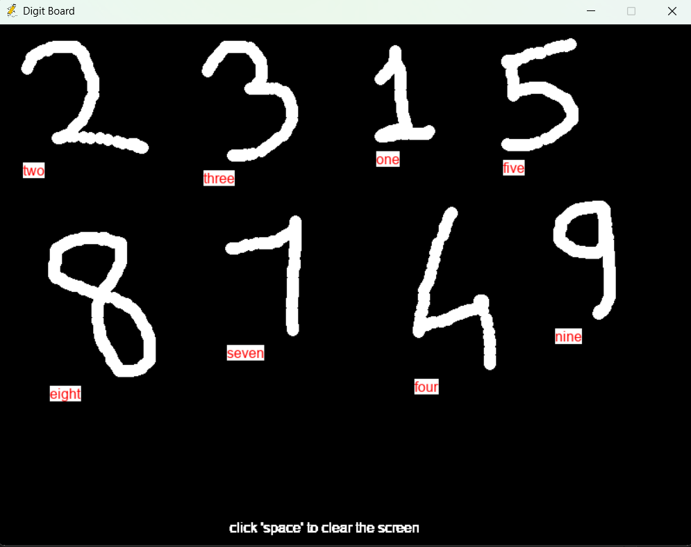

# Handwritten Digit Recognition

This project is a **Handwritten Digit Recognition** system that uses a **Convolutional Neural Network (CNN)** to classify digits from 0 to 9. It takes input from the user through a graphical interface built using **Pygame**, predicts the digit using the trained CNN model, and displays the result.

## Project Showcase

    Use 'ctrl' + 'shift' + 'v' in vscode to read this file



## Project Structure

- **Languages & Libraries Used**: 
  - **Python**
  - **TensorFlow/Keras**: For building and training the CNN model.
  - **Sklearn**: For data processing.
  - **Numpy**: For numerical operations.
  - **Pandas**: For data manipulation.
  - **Pygame**: For building the graphical user interface where users can draw digits.
  - **Matplotlib**
This project is a **Handwritten Digit Recognition** system that uses a **Convolutional Neural Network (CNN)** to classify digits from 0 to 9. It takes input from the user through a graphical interface built using **Pygame**, predicts the digit using the trained CNN model, and displays the result.

## Project Structure

- **Languages & Libraries Used**: 
  - **Python**
  - **TensorFlow/Keras**: For building and training the CNN model.
  - **Sklearn**: For data processing.
  - **Numpy**: For numerical operations.
  - **Pandas**: For data manipulation.
  - **Pygame**: For building the graphical user interface where users can draw digits.
  - **Matplotlib**: For visualizing results.
  
## Features

- A simple GUI to take user input through Pygame where the user can draw a digit.
- A trained CNN model that classifies the drawn digit into one of the 10 classes (0-9).
- Instant display of the predicted result after the user draws the digit.

## Dataset

The model is trained on the **MNIST** dataset, which consists of 70,000 images of handwritten digits (60,000 for training and 10,000 for testing).

- **Dataset URL**: The MNIST dataset is available directly through the `tensorflow.keras.datasets` module.

## Project Files

- **`app.py`**: The main Python script containing code for the CNN model, Pygame interface, and prediction logic.
- **`model.keras`**: The trained CNN model file (saved using Keras).
- **`requirements.txt`**: A file listing the required libraries and dependencies for the project.

## How the Model Works

1. **Model Architecture**:
   - Input Layer: Takes 28x28 grayscale images (from MNIST or drawn by the user).
   - 2 Convolutional Layers: Detects features such as edges, corners, and textures.
   - Max-Pooling Layers: Reduces the dimensionality.
   - Fully Connected Layer: Makes the final classification between 0-9.
   
2. **Training**:
   - The CNN model is trained on the MNIST dataset.
   - Training involves optimizing the categorical cross-entropy loss function and using the Adam optimizer.
   - Achieved high accuracy on both training and testing sets (around 99%).

## How to Run the Project

### 1. Prerequisites

Ensure that you have the following installed:
- **Python 3.x**
- **Pygame**
- **TensorFlow/Keras**
- **Numpy**
- **Pandas**

You can install all dependencies using the `requirements.txt` file:

```bash
pip install -r requirements.txt


